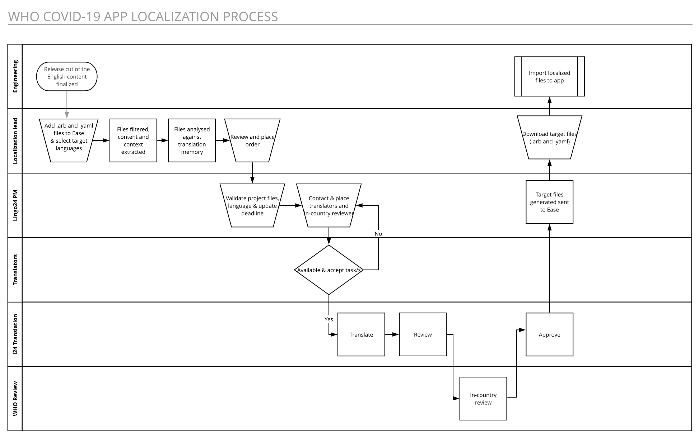

# Localizing the WHO COVID-19 App

## Localizable Content Streams:

- [Flutter Application Resource Bundles (client/lib/l10n)](../../client/lib/l10n)

  The `.arb` files externalize strings from the app and `flutter_intl` takes care of generating the messages in
  [client/lib/generated/intl](../../client/lib/generated/intl)

  Application Resource Bundle (abbr. `ARB`) is a localization resource format that is simple (based on `JSON`).

  Read the [Application Resource Bundle Specification](https://github.com/google/app-resource-bundle/wiki/ApplicationResourceBundleSpecification)
  to find out more about the `ARB` syntax and learn more about `ICU` messages and play with examples,
  or your own using [this project on GitHub](https://format-message.github.io/icu-message-format-for-translators/)

  Versions packaged in the app are not updated dynamically.

- [Dynamic Assets: content_bundles (client/assets/content_bundles)](../client/assets/content_bundles)

  The `.yaml` files in this folder packaged in the app for users without internet connectivity, but the app
  attempts to fetch updated versions online if available.

  This means the translation of the `.yaml` files doesn't technically have to be complete for the app to be released.

## Translation Process:

1. Externalise all strings from the `.dart` files into the `.arb` files.
2. The localization manager(s) or project lead(s) downloads the `.arb` & `.yaml` files.
3. The localization manager(s) or project lead(s) create project on [here](https://ease.lingo24.com) with the downloaded files for the desired language combinations.
4. Professional Translators translate the files
5. Professional Translators review the translation
6. In country reviewers / WHO staff approve the translations in the [CAT tool](https://coach.lingo24.com)
7. The localization manager(s) or tech lead(s) are notified the translations are ready to download
8. The localization manager(s) or tech lead(s) copy the files in the repo, overwriting any existing files, and commit
   them.



> API integration to come at a later stage

## Do's & Don't

### Common requirement

- [x] Keep the file encoding consistent: `UTF-8` with `LF` line endings.

### ARB files

_Externalize by default_

- [ ] Never commit "magic" strings inline in dart files. Those won't be localised.

_Structure the content_

- [ ] Never re-use key-value pairs in different area of the app, even if the value is the same.
- [x] Group key names that are used in the same area
- [x] Pre-fix your key names to help identify where the key is used.
- [x] Use signposting in the arb files using the `@section` key name.

_Author strings with translation in mind_

- [ ] Avoid large blocks in key-value pairs, and if you do use them, make sure you use valid HTML to style and
      segment the content.
- [ ] Do not rely on new lines (`\n`) to structure or style text. If the element that uses the key relies on this it
      'll most likely break the style when translated.
- [x] Keep in mind almost all languages expand from English. Text displayed in a foreign language will
      most likely be longer than in English.
- [x] Do not concatenate keys in code, fragmentation of the content can be a blocker for translation.
- [x] Use placeholder variables in the string when appropriate, with meaningful names to allow the translator to
      understand the placeholder's role
- [x] Annotate the key-value pairs (with or without placeholders) to provide valuable context to the translators.
      Annotation such as `description`, `type` & `placeholders` are visible to the translators in the CAT tool.
- [x] When writing ICUs such as plural forms, include the entire segment in each option, to allow the translator to
      work on a full translation unit, not a fragment of text.

[_Example_](localization/example.arb)

```json
{
  "greetingsText": "{ gender, select,  male{Dear {firstName} } female{Dear {firstName} } other{Dear {firstName} } }, this is an ICU Message example that shows gender forms.",
  "@greetingsText": {
    "description": "User greeting",
    "type": "text",
    "placeholders": {
      "firstName": "Foo Bar"
    }
  },
  "pushCounterText": "This ICU Message example that shows plural forms. {count, plural, =0{You have never pushed the button} =1{You have pushed the button once} other{You have pushed the button {pushCount} times in a row} }",
  "@pushCounterText": {
    "description": "A description for the push counter",
    "type": "text",
    "placeholders": {
      "pushCount": "3"
    }
  },
  "icuMessageFormatForTranslators": "Visit this page: <a href=\"{url}\">Online ICU Message Editor</a> to learn how to write ICU Messages with confidence.",
  "@icuMessageFormatForTranslators": {
    "description": "A link to Online ICU Message Editor",
    "type": "url",
    "placeholders": {
      "url": "https://format-message.github.io/icu-message-format-for-translators/"
    }
  },
  "notRecommendedButSupportedText": "<ul><li>apple</li><li>banana</li><li>kiwi</li></ul>",
  "@notRecommendedButSupportedText": {
    "description": "Shows a list of items in HTML, each item is treated as a segment in the CAT tool",
    "type": "html"
  }
}
```

### YAML content bundles

_Structure the content_

- [x] Name the file with a meaningful name
- [x] Inform the localization manager(s) when you add new schema. File filtering configuration needs to be
      updated when new key names need to be added to the whitelist of keys included for translation:

  - `title_html`
  - `body_html`
  - `title`
  - `subtitle`
  - `button_text`
  - `banner`
  - `body`
